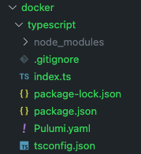
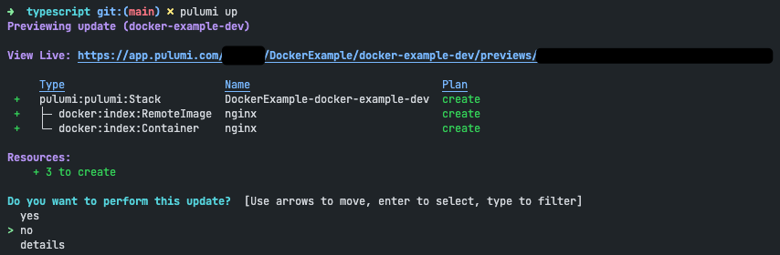

# Pulumi examples for Docker

## Getting started
- First step is always [installing Pulumi](../../README.md).
- You need of course have Docker running.

### Using Typescript
- Open a terminal window and navigate to a folder in which you want to create your Pulumi Project.
- Type: `pulumi new typescript`
- Enter your Pulumi access token or enter to login in using the browser (create an account if you have not done yet)
- Enter a name for your project, e.g.: `DockerExample` (A project name may only contain alphanumeric, hyphens, underscores, and periods)
- Enter a description, e.g. : `Docker example project`
- Enter a stack name, e.g.: `docker-example-dev` (a stack is linked to your organization and project and has its own set of configuration)
- The project is now being created and required NPM modules are installed.
- The file strcuture will look like:

  
- Now let's install the Docker provider by typing in the terminal window: `npm i @pulumi/docker`. This add the Docker package to your `package.json` file.
- Next open `index.ts` in your favorite code editor and enter the following code:

  ```typescript
    import * as docker from '@pulumi/docker';

    // Pull nginx image from registry
    const nginxImage = new docker.RemoteImage('nginx', {
    name: 'nginx:1.21.3-alpine'
    });

    // Create new docker container and expose 80 at 8080
    new docker.Container('nginx', {
    image: nginxImage.latest,
    ports: [{ internal: 80, external: 8080 }]
    });
  ```
- This example will create 2 resources:
  1. a remote image resource that will pull the specified image to the machine
  2. a container resource which will run the image and expose the mentioned ports (Note: change the ports if they are already in use)
- Let run the code by typing in the terminal window: `pulumi up`
  
  
- Choose to perform the update
- Confirm it works by visiting http://localhost:8080
- If you perform a `docker ps` you will see that the container has a generated name. If you want to give it your own name, update the code:
  ```typescript
  new docker.Container('nginx', {
    name: 'my-nginx-container',
    image: nginxImage.latest,
    ports: [{ internal: 80, external: 8080 }]
    });
  ```
  And perform a `pulumi update` again. You will see that the existing container will be replaced. The same will occur if you change for example the ports after the stack is already up.
- Run `pulumi destroy` to revert your actions.
- An example with PostgreSQL container plus a volume can be found in the container-with-volumes folder
